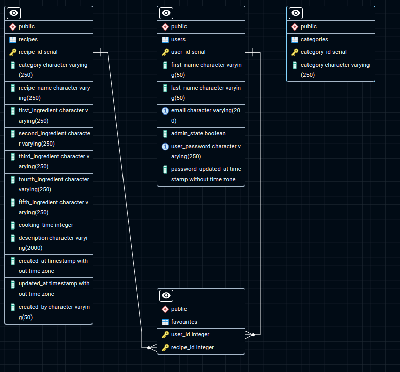

# Recipe Finder

## Introduction

A simple backend Recipe finder-generator application built with Node.js, Express, and PostgreSQL.

## Features

- User Authentication:

  - Users can create an account, log in, and log out securely using JWT (JSON Web Tokens) for authentication.

- CRUD Operations for Recipes:

  - Create: Users can add new recipes by providing the required fields.
  - Read: Users can view a list of all recipes or generate a specific recipe by giving specific ingredients.
  - Update: Users can edit (only) their recipes to modify ingredients, instructions, or other details.
  - Delete: Users can remove (only) their recipes they no longer want to keep.

- Search and Filtering:

  - Users can search and filter recipes based on recipe names.

- User Profiles:
  - Each user has a profile where they can add, update and delete their recipes or add recipes to favorites while they can manage their account settings too.

## Technologies Used

- Node.js
- Express
- PostgreSQL
- Pg
- JWT
- Bcrypt

## Installation

1. Clone the repository:
   `git clone https://github.com/nikgiannnjs/recipe-finder.git`

2. Navigate to the project directory:
   `cd recipe-generator`

3. Install dependencies:
   `npm install`

4. Set up PostgreSQL database:

   - Run the queries found in the SQL file, in your PostgreSQL database, in this order:
     1. createTables
     2. recipeInserts
     3. categoriesInsert
   - (adminInsert can be run after the creation of a user for giving administration rights to a user.)

5. Update the dbconnection with your PostgreSQL credentials.

6. Start the application:
   `npm start`

## Usage

A user creates their profile by providing a first name, last name, email, and password. They can search for recipes based on recipe name or can give (3-5) specific ingredients to find matching recipes. The user can save recipes to their favorite list (favourites table in database) and unsave them as well. They can add recipes for all users to see, update, and delete them. Users can update and delete only the recipes they have added, except if the user is an admin.

## API Endpoints

### Authentication

- `POST` `/recipefinder/auth/registration`\
   Creates a new user. Requires a JSON body:

  ```js
  {
    "firstName": "firstName",
    "lastName": "lastName",
    "email": "test@gmail.com",
    "password": "userPassword",
    "passwordConfirm": "userPassword"
  }
  ```

- `POST` `/recipefinder/auth/login`\
  User login. Requires a JSON body:

  ```js
  {
    "email": "test@gmail.com",
    "user_password": "userPassword"
  }
  ```

- `POST` `/recipefinder/auth/updateemail/:id`\
  Update user email. Requires a JSON body and a user id as a parameter:

  ```js
  {
    "email": "test@gmail.com"
  }
  ```

- `POST` `/recipefinder/auth/updateusername/:id`\
  Update user first name and last name. Requires a JSON body and a user id as a parameter:

  ```js
  {
    "first_name": "Demo first name",
    "last_name": "Demo last name"
  }
  ```

- `POST` `/recipefinder/auth/changepassword`\
  Changes the user's password. Requires a JSON body:

  ```js
  {
    "email": "test@gmail.com",
    "oldPassword": "oldPassword",
    "newPassword": "newPassword",
    "newPasswordConfirm": "newPassword"
  }
  ```

- `POST` `/recipefinder/auth/forgotpassword`\
  Sends email with link for change password. Requires a JSON body:

  ```js
  {
    "email": "test@gmail.com"
  }
  ```

- `POST` `/recipefinder/auth/logout`\
  User logout. Does not need a body, it only deletes the token.

### Recipes

- `GET` `/recipefinder/recipes/allrecipes`\
  Shows the user all the available recipes.

- `POST` `/recipefinder/recipes/addnewrecipe/:id`\
  The user can add a new recipe. Requires a JSON body and the user id as URL parameter:

  ```js
  {
    "category": "Dessert",
    "recipe_name": "Chocolate Lava Cake",
    "first_ingredient": "Dark chocolate",
    "second_ingredient": "Butter",
    "third_ingredient": "Sugar",
    "fourth_ingredient": "Eggs",
    "fifth_ingredient": "Flour",
    "cooking_time": "15",
    "description": "Indulge in this rich and decadent chocolate lava cake,
    featuring a gooey molten center that flows out when you cut into it.
    Made with dark chocolate and butter, this dessert is quick to prepare
    and perfect for impressing guests or treating yourself."
  }
  ```

- `GET` `/recipefinder/recipes/findrecipe?q=firstIngredient&q=secondIngredient&q=thirdIngredient`\
  Generates a recipe based on the ingredients. The user must give at least three ingredients as a query string.

- `POST` `/recipefinder/recipes/updaterecipe/:id?user_id=test`\
  Updates a recipe. Requires the recipe id as a parameter and the user id as query string.

- `GET` `/recipefinder/recipes/myrecipes/:id`\
  Gets all the recipes of the id given as a parameter.

- `DELETE` `/recipefinder/recipes/deleterecipe/:id?user_id=test`\
  Deletes a recipe only if the user is an admin. Requires the recipe id as a parameter and the user id as a query string.

- `GET` `/recipefinder/recipes/search?q=test`\
  Finds a recipe based on the recipe name. Works as a searchbar. Requires the user's input as a query string.

### Users

- `GET` `/recipefinder/users/getallusers/:id`\
  Gets all users, only if the user is an admin. Requires a user id as a parameter.

- `DELETE` `/recipefinder/users/deleteuser/:id?user_id=test`\
  Deletes a user, only if the user is an admin. Requires a user (to be deleted) id as a parameter and the user (the admin) id as a query string.

- `POST` `/recipefinder/users/addtofavourites/:id?user_id=test`\
  Adds a recipe to the user's favorites. Requires the recipe id to be added as a parameter and the user id as a query string.

- `GET` `/recipefinder/users/favourites/:id`\
  Gets all the user's favorites. Requires the user id as a parameter.

- `DELETE` `/users/deletefavourites/:id?user_id=test`\
  Deletes a recipe from the user's favorites. Requires the recipe id as a parameter and the user's id as a query string.

## Database Schema

#### erDiagram


